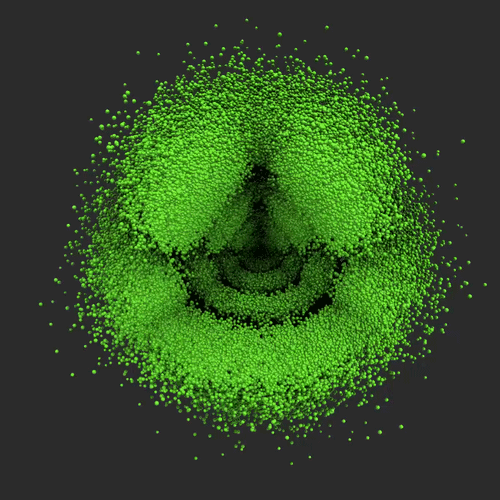
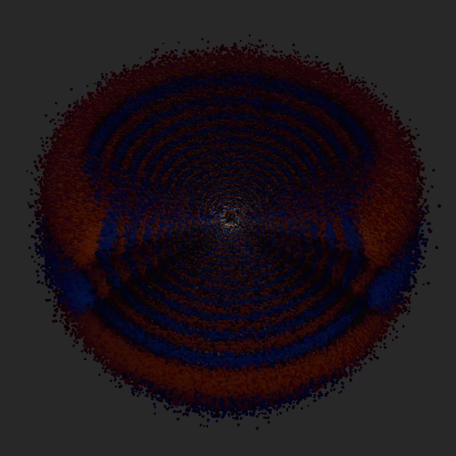
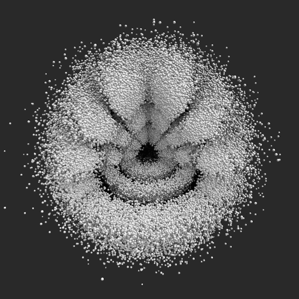

#### Try here: https://vossr.github.io/Atomic-orbitals-animated/

  
  
  

## Real-time 3D atomic orbitals, motion showing the flow of the wave function

only hydrogen (and other one-electron ions) has an exact analytic solution  
everything past hydrogen requires approximation  
using bohmian trajectories to visualize the wavefunctions of atomic orbitals  

inspired by: https://www.youtube.com/watch?v=W2Xb2GFK2yc

### Quantums

- n: the principal quantum number, the electron's energy level and shell. there's no upper limit on n in the theory
- l: the azimuthal quantum number, shape of the orbital
- m: the magnetic quantum number, sets the orbital orientation
